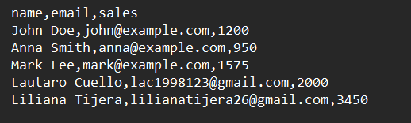
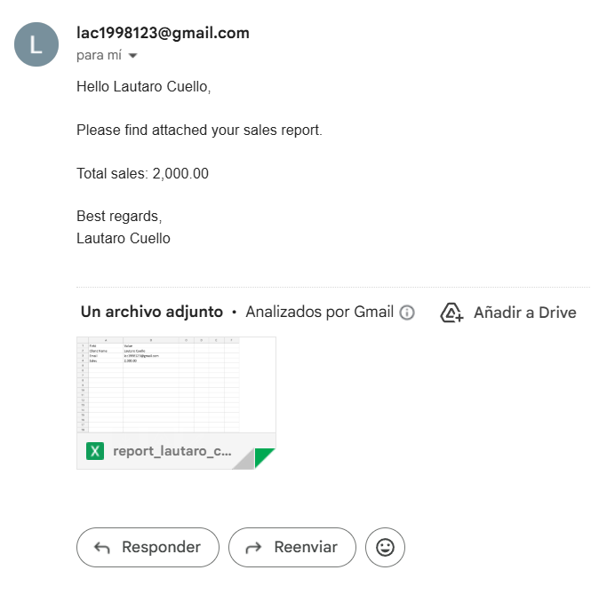
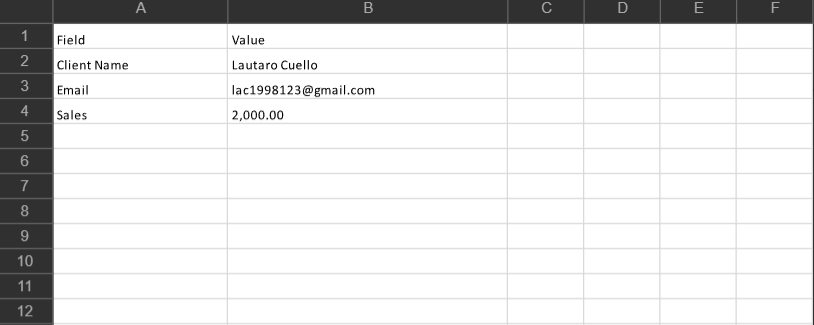

# 📧 Email Report Automation

> Python CLI tool that generates personalized Excel sales reports from CSV data and delivers them automatically via email using SMTP.

  
  
  

---

## ✨ Overview

Email Report Automation is a Python CLI tool designed to automate a common business workflow: generating reports for multiple clients and delivering them automatically via email.

Starting from a structured CSV file containing client data, the system validates the records, generates individual Excel reports, and sends them via SMTP using a configurable email template.

The project demonstrates practical automation patterns commonly used in real-world software systems, including:

- structured project architecture
- environment-based configuration
- logging
- automated testing
- CLI-based execution

It is designed as a **portfolio-ready example of Python automation and reporting workflows**.

---

## ⚡ Quick Start

Clone the repository:

    git clone https://github.com/Lautarocuello98/email-report-automation.git

Move into the project directory:

    cd email-report-automation

Install dependencies:

    pip install -r requirements.txt
    pip install -r requirements-dev.txt

Run the application in dry-run mode (recommended for testing):

    python main.py --dry-run

Dry-run mode simulates email delivery without sending real emails.

---

## 📸 Example

### 📥 Input (Clients CSV)

Example dataset used as input.

---

### 📧 Generated Email

Example email automatically generated by the system.

---

### 📊 Generated Excel Report

Example Excel report created for each client.

The generated report typically includes:

- client name
- client email
- sales value
- structured Excel output ready for delivery

---

## 🚀 Features

| Feature | Description |
|-------|-------------|
| CSV ingestion | Load client data from a structured CSV file |
| Input validation | Validate required fields before processing |
| Excel report generation | Create one `.xlsx` report per client |
| Email templating | Render personalized email content from a text template |
| SMTP delivery | Send reports automatically through email |
| Dry-run mode | Simulate execution without sending emails |
| Logging | Execution results stored in a log file |
| Tests | Automated testing with pytest |
| CI pipeline | GitHub Actions runs tests on push and pull requests |

---

## 🏗 Architecture

Current execution pipeline:

    main.py (wrapper/entrypoint)
      -> src/email_report_automation/cli.py
      -> src/email_report_automation/workflow.py
           -> validation.py
           -> report_generator.py
           -> email_sender.py
           -> config.py

Module responsibilities:

main.py

- compatibility wrapper that runs the package CLI

src/email_report_automation/cli.py

- CLI argument parsing
- `.env` loading
- workflow trigger

src/email_report_automation/workflow.py

- workflow orchestration
- execution summary
- runtime error handling

src/email_report_automation/validation.py

- CSV row validation
- sales normalization

src/email_report_automation/report_generator.py

- loads email template
- generates Excel reports
- handles report filenames

src/email_report_automation/email_sender.py

- sends emails with attachments
- logs execution results

src/email_report_automation/config.py

- loads environment configuration
- validates and provides typed SMTP settings

This structure keeps responsibilities explicit and improves readability, maintainability, and testability.

---

## 📁 Project Structure

    email-report-automation/
    |
    |-- main.py
    |-- requirements.txt
    |-- requirements-dev.txt
    |-- pytest.ini
    |-- README.md
    |-- LICENSE
    |
    |-- .github/
    |   `-- workflows/
    |       `-- ci.yml
    |
    |-- src/
    |   `-- email_report_automation/
    |       |-- __init__.py
    |       |-- __main__.py
    |       |-- cli.py
    |       |-- workflow.py
    |       |-- validation.py
    |       |-- report_generator.py
    |       |-- email_sender.py
    |       `-- config.py
    |
    |-- data/
    |   `-- clients.csv
    |
    |-- templates/
    |   `-- email_template.txt
    |
    |-- output/
    |   `-- reports/
    |       `-- .gitkeep
    |
    |-- logs/
    |   `-- .gitkeep
    |
    |-- tests/
    |   |-- conftest.py
    |   |-- test_email_sender.py
    |   |-- test_main_validation.py
    |   `-- test_report_generator.py
    |
    `-- images/

---

## ⚙️ Configuration

Create a `.env` file based on `.env.example`.

Supported environment variables:

    EMAIL_ADDRESS
    EMAIL_PASSWORD
    SMTP_SERVER
    SMTP_PORT
    SMTP_USE_STARTTLS
    SMTP_TIMEOUT_SECONDS

Example configuration:

    EMAIL_ADDRESS=your_email@gmail.com
    EMAIL_PASSWORD=your_app_password
    SMTP_SERVER=smtp.gmail.com
    SMTP_PORT=587
    SMTP_USE_STARTTLS=true
    SMTP_TIMEOUT_SECONDS=30

---

## ▶️ Usage

Run the application normally:

    python main.py

Run in dry-run mode (recommended during development):

    python main.py --dry-run

Display CLI help:

    python main.py --help

Override default paths:

    python main.py --data-file data/clients.csv --template-file templates/email_template.txt --output-dir output/reports --log-file logs/email_log.txt --env-file .env

Optional package execution mode (PowerShell):

    $env:PYTHONPATH='src'; python -m email_report_automation --dry-run

---

## 🧪 Tests

Run the automated test suite:

    pytest -v

The test coverage includes:

- CSV row validation
- sales normalization
- report filename sanitization
- template loading
- Excel report generation
- SMTP configuration validation
- logging behavior

Continuous Integration:

- `.github/workflows/ci.yml` runs tests on every push and pull request
- test matrix: Python 3.10, 3.11, and 3.12

---

## 🧰 Tech Stack

- Python
- pandas
- openpyxl
- python-dotenv
- pytest

---

## 📄 License

This project is licensed under the **MIT License**.

See LICENSE for details.

---

## 👨‍💻 Author

Lautaro Cuello

GitHub  
https://github.com/Lautarocuello98

LinkedIn  
https://www.linkedin.com/in/lautaro-cuello-7ba4063a3/

---

⭐ If you found this project useful, consider giving the repository a star.
